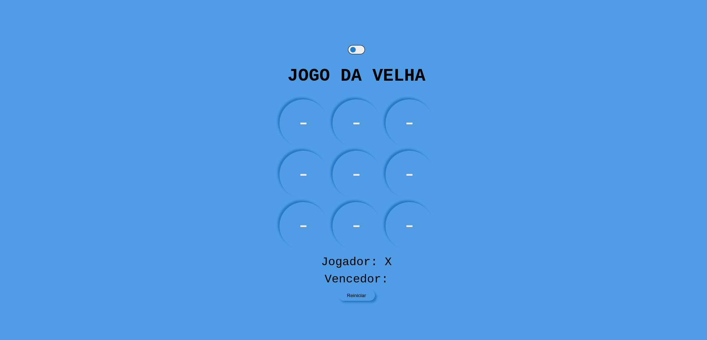
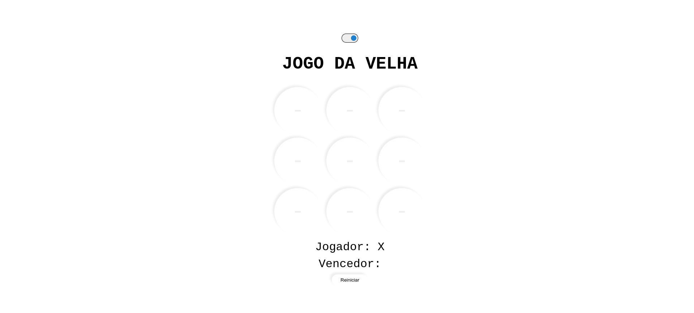

# Descrição do projeto
Neste projeto, desenvolvemos juntos um jogo da velha utilizando HTML, CSS e Javascript.

## Table of contents

- [Descrição do projeto](#descrição-do-projeto)
  - [Table of contents](#table-of-contents)
  - [Overview](#overview)
    - [Screenshot](#screenshot)
  - [My process](#my-process)
    - [Built with](#built-with)
    - [tic-tac-toe](#tic-tac-toe)
    - [Para rodar o projeto](#para-rodar-o-projeto)
  - [Links](#links)
  - [Author](#author)

## Overview

### Screenshot

## My process

### Built with

- Semantic HTML5 markup
- CSS custom properties
- Flexbox
- JS

### tic-tac-toe

Projeto produzido para um bootcamp em parceria com a [Digital Innovation One](https://digitalinnovation.one).

### Para rodar o projeto

Para executarmos o projeto, basta apenas abrir o arquivo index.html em um navegador de preferência.

## Links

[PPT utilizado](https://docs.google.com/presentation/d/1-ao-3echbBHzdSqRF726K4GUFMn7JoL0dhoJWyPORXY/edit?usp=sharing)

## Author

- Website - [Portfólio](https://lucasf5.github.io/Portifolio/)
